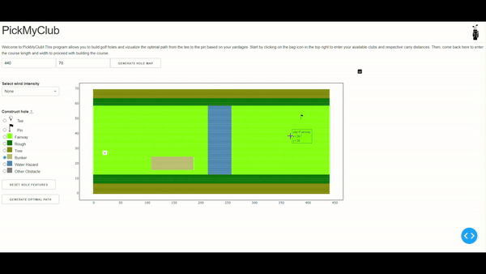

# PickMyShot

Build a golf hole and visualize the optimal path from tee to pin.

<p align="center">
  
</p>

## Description

This program allows a user to build a custom golf hole, input their available clubs and respective carry distances and vizualize the optimal path that they should take to get to the hole. The frontend was built using Dash with HTML and CSS components while the backend is in Python. The program models (almost) all possible shots as a directed graph according to the available club distances. To determine the optimal path from tee to pin, a custom A* Search algorithm is used, determining edge weights based on factors like shot distance, lie, wind, number of obstacles, proximity of endpoint to a hazard and using distance to the pin as the heuristic function.

## Getting Started

### Installing

1. Install Anaconda. Installation instructions can be found [here](https://conda.io/projects/conda/en/latest/user-guide/install/index.html).
2. Clone this repository or download using Code -> Download ZIP and unpack the .zip file.
3. Open the Anaconda Prompt, navigate to the project folder and enter
   ```
   conda env create -f environment.yml
   ```
   to create a new environment named "pickmyshot" with the required dependencies.

### Executing the program

1. Open the Anaconda Prompt and activate the environment
   ```
   conda activate pickmyshot
   ```
2. Navigate to the project folder.
3. Run the app using
   ```
   python app.py
   ```
4. Open a browser and enter "localhost:8050" in the search bar.

## Ongoing Additions

1. Incorporate stochastic elements into shot cost (needs more research into how the factors would affect probability of shot success).
2. Allow users to upload an image of the hole map and convert this into a PickMyShot hole.
3. Allow users to upload their shots for a specific hole to enable a dynamic weight calculation based on previous performance.

## Author

Jack Quirion\
<jquir073@uottawa.ca>
